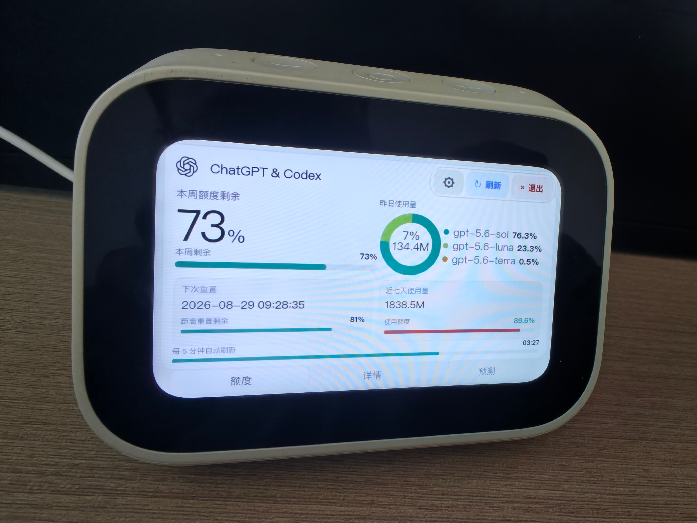
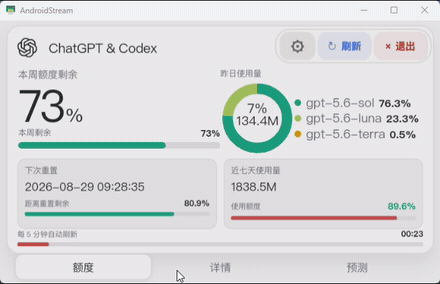
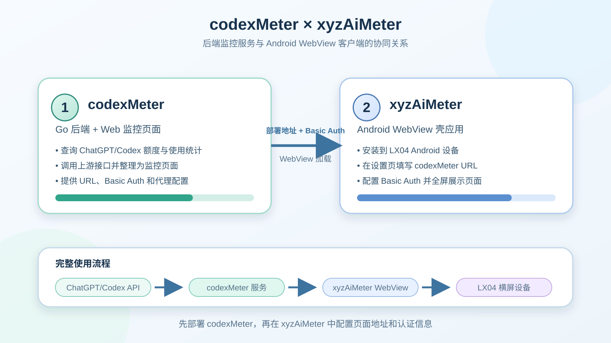
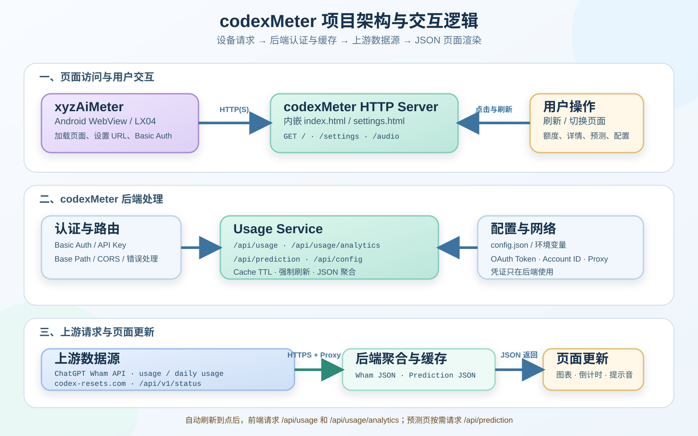

# ChatGPT & Codex 使用额度面板

这是一个使用 Go 编写的单文件后端应用，内嵌 HTML 前端页面，适用于 LX04 Android WebView 额度面板。

默认显示 ChatGPT 的只读额度和统计数据。

数据查询不会提交模型提示词，也不会发起模型探测请求，因此额度查询不会通过发送对话请求来获取数据。

## 效果演示

### 设备实机效果



### 操作演示动画



## 项目关系与协同使用

本项目需要配合 [xyzAiMeter](https://github.com/xyzphp/xyzAiMeter) 使用，才能在 LX04 Android 设备上达到完整的额度监控效果。

- [codexMeter](https://github.com/xyzphp/codexMeter)：Go 后端和 Web 监控页面，负责请求 ChatGPT/Codex 相关接口、整理额度与使用统计，并提供可访问的页面地址。
- [xyzAiMeter](https://github.com/xyzphp/xyzAiMeter)：Android WebView 壳应用，负责在 LX04 设备上加载 codexMeter 页面，并提供 URL、Basic Auth 等配置入口。

两个项目的配合顺序如下：

1. 先部署并启动 `codexMeter`，获得可访问的页面地址。
2. 如果服务启用了 Basic Auth，在 `xyzAiMeter` 设置页填写对应用户名和密码。
3. 安装并启动 `xyzAiMeter`，填写 `codexMeter` 页面 URL。
4. Android WebView 加载页面，在设备上显示额度、统计和预测信息。



### 项目架构与交互逻辑

下图展示 Android WebView、codexMeter 后端、认证与缓存层，以及 ChatGPT Wham 和公共预测接口之间的请求与返回关系：



## 主要功能

- 查询 ChatGPT OAuth 账号额度、Token 使用量和重置时间
- 显示本周剩余额度、近七天使用量和各模型占比
- 查询最近七个已完成日期的 Token、对话轮次和模型使用情况
- 对接公开的 Codex Reset 预测接口
- 支持自动刷新、额度区间提示音、HTTP Basic Auth、API Key 和代理
- 前端页面内嵌到 Go 二进制文件中

## 运行

复制配置模板：

```bash
cp config.example.json config.json
```

填写 OAuth Access Token 和 ChatGPT Account ID 后，启动服务：

```bash
go run .
```

当前部署页面地址：

```text
额度页面：http://127.0.0.1:8123/
配置页面：http://127.0.0.1:8123/settings
```

默认只监听本机地址。启用管理密钥或 Basic Auth 后，请按照[配置接入文档](docs/openai-config.md)完成配置。

### Docker 运行

Docker 构建、Compose 启停、配置挂载和反向代理说明见 [Docker 运行文档](docs/docker.md)。快速启动：

```bash
cp config.example.json config.json
```

```bash
docker compose pull
```

```bash
docker compose up -d
```

默认访问端口为 `8123`。创建新发布版本时，GitHub Actions 会先将 Compose 文件更新为对应版本号，再执行构建和发布；手动使用时也可以拉取 `ghcr.io/xyzphp/codexmeter:latest`。配置文件通过卷挂载到容器中，设置页面保存的配置会保留在宿主机的 `config.json`。

`docker-compose.yml` 用于部署已发布的 GHCR 镜像；`docker-compose.local.yml` 用于从当前源码构建和启动本地镜像。

## 前端与 UI 文档

前端页面结构、Go 内嵌构建方式、Android WebView 设置和 UI 适配验收规范见 [docs/frontend-ui.md](docs/frontend-ui.md)。

## 发布文档

GitHub Actions 自动发布、触发方式、构建平台和发布包内容见 [docs/github-actions.md](docs/github-actions.md)。

## 配置文档

配置文件、环境变量、认证、代理和 OpenAI/ChatGPT 凭证的完整说明见 [OpenAI 配置接入说明](docs/openai-config.md)。

## 接口文档

接口路径、OpenAPI 3.0 定义、认证、反向代理、调用示例和错误处理见：

- [openapi.yaml](openapi.yaml)：可导入 Swagger UI、Postman、Apifox；
- [docs/openapi.md](docs/openapi.md)：中文接口接入和部署说明。
