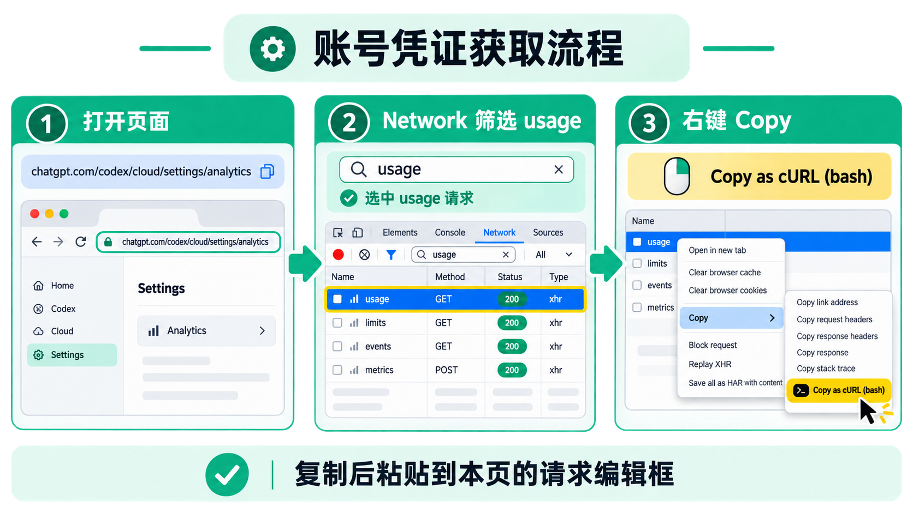

# ChatGPT Web cURL 配置更新指南

本项目读取的是 ChatGPT Web 的内部额度接口，例如：

```text
https://chatgpt.com/backend-api/wham/usage
```

这不是 OpenAI Platform 的公开 API。ChatGPT Web 更新客户端版本、登录会话或风控策略后，原来的 Token、Cookie 或客户端上下文可能失效。出现 `401`、`403` 或“浏览器能访问、项目不能访问”时，应使用浏览器当前成功请求重新配置。

## 一、重新抓取当前请求

配置页面中的操作示意：



1. 打开自己有权访问的 [ChatGPT 使用分析页](https://chatgpt.com/codex/cloud/settings/analytics) 并登录。
2. 按 `F12` 打开开发者工具，切换到 **Network/网络**。
3. 在过滤框输入 `usage`，刷新页面，找到状态码为 `200` 的：

   ```text
   /backend-api/wham/usage
   ```

4. 右键该请求，选择 **Copy → Copy as cURL (bash)**；也可以根据当前终端选择 CMD、PowerShell 或其他 cURL 格式。

只从自己当前登录的浏览器会话抓取请求。不要把完整 cURL 粘贴到工单、聊天记录、公共仓库或在线转换网站中。

## 二、从 cURL 提取配置

项目只需要 cURL 中与账户和浏览器会话相关的字段。不要把整段 cURL 原样放进 `config.json`。

| 浏览器请求字段 | `config.json` 字段 | 是否建议配置 | 说明 |
| --- | --- | --- | --- |
| `Authorization: Bearer <token>` | `openai.access_token` | 必填 | 只复制 `<token>`，不要重复写 `Bearer ` |
| `Cookie: ...` 或 `--cookie ...` | `openai.cookie` | 按需 | 复制完整 Cookie 串；仅服务端向 ChatGPT Web 发送 |
| `chatgpt-account-id` | `openai.chatgpt_account_id` | 通常必填 | 必须与 OAuth Token 属于同一账户 |
| `oai-client-build-number` | `openai.client_build_number` | 推荐 | ChatGPT Web 当前构建号 |
| `oai-client-version` | `openai.client_version` | 推荐 | ChatGPT Web 当前版本标识 |
| `oai-device-id` | `openai.device_id` | 推荐 | 当前浏览器设备标识 |
| `oai-session-id` | `openai.session_id` | 推荐 | 当前浏览器会话标识 |
| `x-oai-is-client-observation` | `openai.client_observation` | 推荐 | 当前客户端观察标识 |
| `Referer` | `openai.referer` | 推荐 | 通常是 ChatGPT 使用情况页面 |
| `User-Agent` | `openai.user_agent` | 推荐 | 浏览器 User-Agent |

以下字段由项目自动补充或不需要写入配置：`Accept`、`Cache-Control`、`Pragma`、`Priority`、`Sec-Fetch-*`、`x-openai-target-path` 和 `x-openai-target-route`。项目会根据实际请求路径自动生成 target path/route，避免不同 Wham 接口之间配置错位。

## 三、写入 JSON 配置

先备份本地配置，再编辑服务端的 `config.json`：

```powershell
Copy-Item config.json config.json.bak
notepad config.json
```

在 `openai` 节点中更新字段：

```json
{
  "openai": {
    "access_token": "从 Authorization 中去掉 Bearer 前缀后的 Token",
    "cookie": "浏览器 cURL 中的完整 Cookie",
    "chatgpt_account_id": "与 Token 对应的 ChatGPT Account ID",
    "client_build_number": "浏览器 oai-client-build-number",
    "client_version": "浏览器 oai-client-version",
    "device_id": "浏览器 oai-device-id",
    "session_id": "浏览器 oai-session-id",
    "client_observation": "浏览器 x-oai-is-client-observation",
    "referer": "浏览器 Referer",
    "user_agent": "浏览器 User-Agent"
  }
}
```

不要提交 `config.json`。它包含 OAuth Token、Cookie 和会话标识，项目默认将它加入 Git 忽略列表。

如果使用 Docker，也可以通过环境变量传入这些字段：

```text
OPENAI_ACCESS_TOKEN
OPENAI_COOKIE
CHATGPT_ACCOUNT_ID
OPENAI_CLIENT_BUILD_NUMBER
OPENAI_CLIENT_VERSION
OPENAI_DEVICE_ID
OPENAI_SESSION_ID
OPENAI_CLIENT_OBSERVATION
OPENAI_REFERER
OPENAI_USER_AGENT
```

## 四、重启并验证

### Go 进程

停止正在运行的进程，重新启动服务，使新的配置生效：

```powershell
go run .
```

### 本地 Docker

编辑挂载到容器的 `config.json` 后重建并启动：

```powershell
docker compose -f docker-compose.local.yml up -d --build
```

查看日志时只查看状态和错误信息，不要输出完整请求头：

```powershell
docker compose -f docker-compose.local.yml logs --tail=100
```

如果配置了 Basic Auth 和 `/codex` 前缀，验证额度接口：

```powershell
curl.exe -u "用户名:密码" "http://127.0.0.1:8123/codex/api/usage?force=true"
```

如果没有配置 `base_path`，地址改为：

```powershell
curl.exe -u "用户名:密码" "http://127.0.0.1:8123/api/usage?force=true"
```

正常情况应返回 HTTP `200`，响应中包含 `source` 和额度数据。统计页面可以进一步验证：

```powershell
curl.exe -u "用户名:密码" "http://127.0.0.1:8123/codex/api/usage/analytics?force=true"
```

## 五、遇到 401/403 时的排查顺序

1. 先在浏览器 Network 中确认当前 `/backend-api/wham/usage` 请求本身仍为 `200`。
2. 重新复制一次成功请求，不要继续使用旧 Token、旧 Cookie 或旧 `oai-session-id`。
3. 确认 `access_token` 没有包含 `Bearer ` 前缀，也没有多余引号或换行。
4. 确认 `chatgpt_account_id` 与 Token 属于同一账户。
5. 同步更新 `client_build_number`、`client_version`、`device_id`、`session_id`、`client_observation`、`referer` 和 `user_agent`。
6. 如果浏览器请求依赖 Cookie，将当前 cURL 中的完整 Cookie 更新到 `openai.cookie`。
7. 检查项目使用的代理与浏览器网络出口是否一致。代理 URL 必须包含协议和端口，支持 HTTP、HTTPS 和 SOCKS5，例如：

   ```text
   http://192.168.0.21:7890
   socks5://192.168.0.21:7891
   ```

8. 重启 Go 进程或 Docker 容器后，再使用 `force=true` 请求验证。

如果浏览器当前请求也返回 `401` 或 `403`，通常需要重新登录 ChatGPT 或刷新会话，而不是继续调整项目参数。

## 六、安全注意事项

- OAuth Token、Cookie、设备 ID 和 Session ID 都属于敏感会话凭证。
- 不要在 README、GitHub Issue、截图、视频、日志或 CI 输出中写入真实值。
- 不要使用在线 JWT 解码网站处理 Token。
- 如果凭证曾经被粘贴到公共位置，应立即退出登录、刷新会话或重新获取凭证。
- 该内部接口可能随 ChatGPT Web 更新而变化，项目不保证其长期稳定性。
